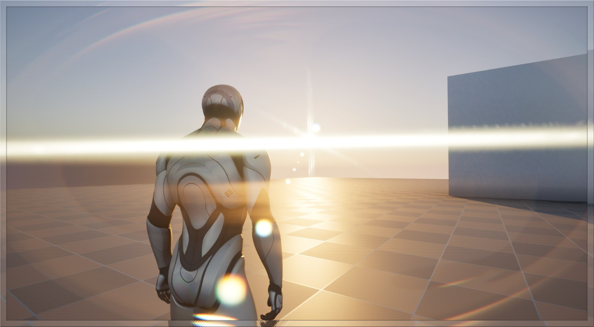
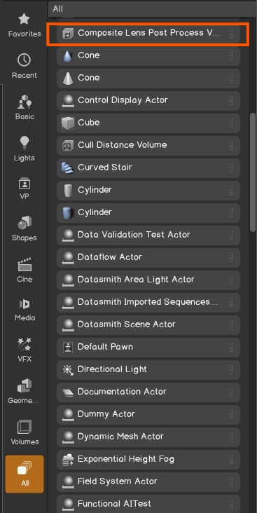
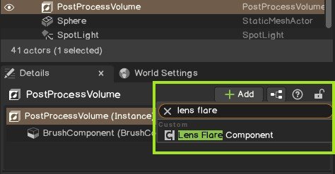
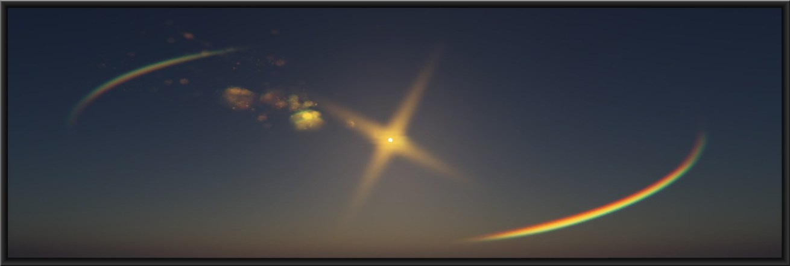
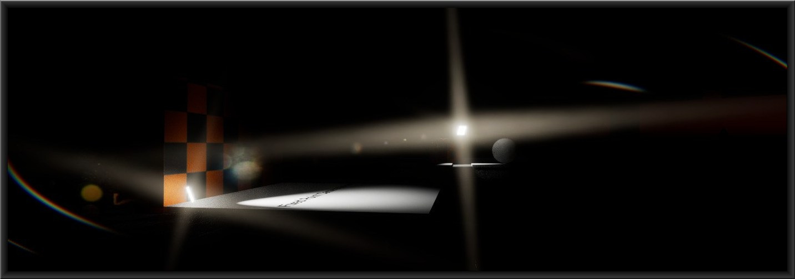
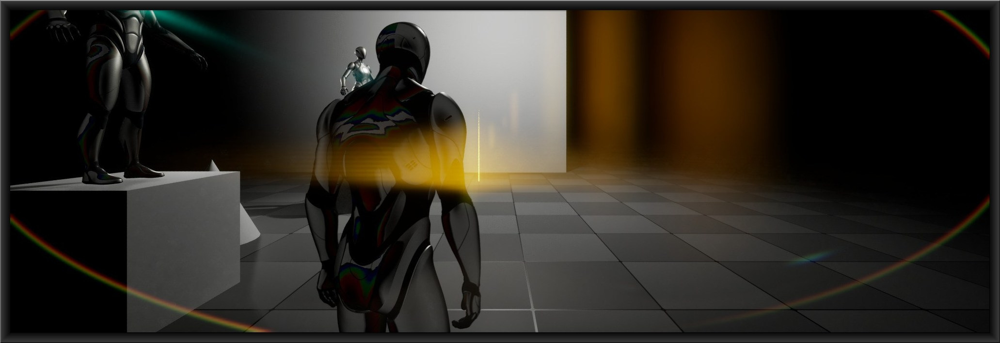

# 😎 Composite Lens Flare Plugin
A Composite Lens flare plugin based on froyok's Implementation made for binary versions of Unreal Engine. 
Written in C++ and HLSL this lens plugin uses Unreal's `FSceneViewExtension` to hook into the post processing pass of Unreal Engine.  

  

## 📦 Features
- Separate Lens flare layer, can be used side by side with Unreal's default lens flare system.  
- Component based integration with post process volumes.
- Preset support.
- Tweakable blur steps general and threshold pass.
- toggleable Ghosts, Halo and Glare.
- Starburst texture support.
- Separate lens dirt texture support.

## How to Use
To use custom lens flare simply enable the plugin in your project and drop in `Composite Lens Post Process Volume` from Place actors tab, if your level already has default unreal post process volumes you can attach `Lens Flare Component` to your already existing post process volume actors.
### 🧊 New Post Process Volume

  

### ⚙️ Post Process Volume For Existing Actors

  

## ⛰️ Images
Preset 2 For Dusk and low light scenes.

  

High Glare for night scenes.

  

Emissives also supported due to image space nature of this system.

  

